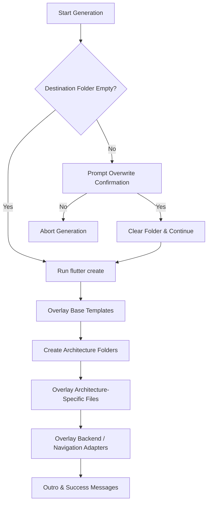

# FlutterInit CLI (create-flutterinit) Developer & Architecture Guide

Welcome to the technical guide and documentation for **FlutterInit CLI** (`create-flutterinit`). This document details the design, architecture, developer workflow, and generation pipeline of the interactive CLI tool built to scaffold production-ready Flutter applications with beautiful layouts, clean folder structures, and pre-integrated backend / state-management architectures.

---

## 1. Overview & Architecture

The CLI is a self-contained Node/Bun-compatible command-line package located under the [cli/](file:///d:/flutter_init/cli) directory. It is published to npm as `create-flutterinit`.

### Key Technologies
- **Runtime**: [Bun](https://bun.sh/) is used for development, script orchestration, and running unit tests.
- **Prompts Engine**: [@clack/prompts](https://github.com/lucasbento/clack) provides a modern, interactive, and terminal-friendly wizard with spinners, multi-select lists, and clean alignment.
- **Styling**: [picocolors](https://github.com/alexeygosebrink/picocolors) handles terminal coloring and highlighting using standard ANSI escape sequences.
- **Templating**: [Handlebars](https://handlebarsjs.com/) is used to compile, resolve, and overlay configuration-based variations on code files (e.g., `pubspec.yaml`, `main.dart`, routing, config files).

---

## 2. Running the CLI

Depending on whether you are using the published package, testing it locally, or developing features, there are different ways to run the CLI.

### A. Published Package (End Users)
Once published to npm, developers can execute the initializer directly using any Node or Bun package runner. They do not need to install the package globally:

```bash
# Using npm/npx
npx create-flutterinit

# Using Bun (faster startup)
bunx create-flutterinit

# Using Yarn
yarn create flutterinit
```

### B. Local Development Run
During active development inside the monorepo, you can run the CLI script directly using the local TypeScript source code:

```bash
# 1. Navigate to the CLI directory
cd cli

# 2. Run the dev script
bun run dev
```

### C. Testing the Compiled Bundle Locally
To ensure the compiled distribution bundle works exactly like the published version before publishing:

```bash
# 1. Compile the TypeScript source
bun run build

# 2. Run the generated production bundle using Node.js
node dist/index.js

# Or run using Bun
bun dist/index.js
```

### D. Global Linking (npm link / bun link)
You can link the package to your local global package store to run `create-flutterinit` as a global command on your system:

```bash
# Inside the cli/ directory
bun link

# Now you can run it anywhere on your machine
create-flutterinit
```

---

## 3. Branding & Design System

The CLI is branded to match the premium, modern aesthetic of FlutterInit.
- **Theme Color**: A custom blue color (`#027DFD`) is used throughout the interactive session.
- **ASCII Banner**: The CLI begins by printing a high-resolution, custom `FlutterInit` ASCII art banner wrapped in the theme color.
- **Step Headers**: Each prompt group (e.g., *Project Identity*, *Architecture*, *State Management*) is preceded by a visually clean block containing a title and description to orient the developer.
- **Context Summaries**: Before performing code generation, Clack prints a detailed configuration summary showing the chosen framework parameters alongside the destination path.

---

## 4. Preflight Checks

Before presenting the prompts, the CLI runs an environment preflight to prevent compilation or setup failures:
1. **Flutter SDK Detection**: Verifies that `flutter` is on the system `PATH` and parses the installed version. If missing, it prints installation instructions and gracefully exits.
2. **Bun Runtime Detection**: Checks the local Bun version. If it is less than `1.0.0`, it prints a warning recommendation.
3. **Environment Diagnosis**: Executes `flutter doctor` synchronously and streams the diagnostic output directly to the terminal, allowing developers to immediately notice device setup or toolchain issues.
4. **Verification Step**: Prompts the developer with a simple Yes/No confirmation check before proceeding to configuration.

---

## 5. Configuration Prompts Flow

The wizard guides developers through a 10-prompt process grouped into sections:

### Section A: Project Identity
- **Project Name**: Enforces lowercase, numbers, and underscores (regex validation matching Flutter's internal requirement: `/^[a-z][a-z0-9_]*$/`).
- **Organization Name**: The reverse-domain identifier (e.g. `com.example`), validated using domain-level checks.
- **Description**: Short text describing the Flutter application.

### Section B: Architecture Patterns
Developers can choose from five architecture types. The generated directory layout and folder structures automatically adapt to this choice:
- **Clean Architecture** (`clean`): High separation into `Data`, `Domain`, and `Presentation` layers. Ideal for scalable, testable apps.
- **MVVM** (`mvvm`): Model-View-ViewModel paradigm. Fully pre-wired to bind presentation layers with state-management files.
- **Feature-First** (`feature-first`): Folders grouped by feature rather than layer (e.g., `auth/`, `home/`), scaling well for mid-sized apps.
- **MVC** (`mvc`): Model-View-Controller. Traditional architecture familiar to web and mobile developers.
- **Layer-First** (`layer-first`): Folders grouped into global architectural layers (`data/`, `domain/`, `presentation/`).

### Section C: Core Technologies
- **State Management**: Choice of `Riverpod`, `Bloc / Cubit`, `Provider`, `MobX`, or `GetX`.
- **Backend Service**: Wired directly into the data and client layers. Options include `Firebase`, `Supabase`, `Appwrite`, or `None`.
- **Navigation Package**: Routing provider. Options: `GoRouter`, `AutoRoute`, or standard `Navigator 2.0` (Vanilla Flutter).

### Section D: Theme & Utilities
- **Theme Mode**: Configures code structure for `Both (light/dark system)`, `Light Only`, or `Dark Only`.
- **Seed Hex Color**: A hexadecimal value (defaulting to `#027DFD`) used to seed the Flutter Material 3 `ColorScheme` generation.
- **Optional Utilities**:
  - `Material 3`: Enables the Material 3 color system natively.
  - `ScreenUtil`: Integrates responsive sizing extensions (`sp`, `dp`, `w`, `h`).
  - `Localization`: Configures native multi-language translation bindings (`flutter_localizations` & `intl`).
  - `Environment Config`: Integrates `.env` loader configurations (`flutter_dotenv`).
  - `Logging`: Mounts standard console-level printers (`logger` package).

---

## 6. Under-the-Hood Generator Pipeline

Once confirmed, the generator executes the pipeline:



### The 6-Step Scaffolding Pipeline
1. **Target Guard**: Scans the output directory. If non-empty, requests overwrite confirmation. If confirmed, deletes the destination using custom recursive file-system utilities.
2. **Flutter Scaffolding**: Launches `flutter create --org <org> --project-name <name> <dir>` to initialize a clean Flutter codebase with platform-specific runner files (iOS, Android, Web, macOS, Windows, Linux).
3. **Base Overlay**: Evaluates and writes global template assets (e.g., `pubspec.yaml`, `main.dart`, custom design documentation) using the custom Handlebars render engine.
4. **Directory Structure Creation**: Generates directories and writes `.gitkeep` placeholders for the selected architecture style.
5. **Architecture Overlay**: Applies templates corresponding to the architecture style (`clean`, `mvvm`, etc.) inside the `lib/src/` folder.
6. **Integration Overlay**: Mounts specific client drivers, data sources, repositories, or dependency-injection files for backend options (Firebase/Supabase/Appwrite) and navigation suites.

---


## 7. Codebase File Layout

The CLI codebase is structured as a standalone TypeScript project:

```
cli/
├── bin/
│   └── index.ts                 # CLI entry executable (shebang runner)
├── src/
│   ├── utils/
│   │   ├── exec.ts              # Sync/visible process runners (execSync wrappers)
│   │   ├── fs.ts                # File system utilities (recursive remove, directory scanners)
│   │   └── logger.ts            # Colored ANSI print helper & banner logo
│   ├── config.ts                # Types, interfaces, and label maps
│   ├── preflight.ts             # SDK and system dependency validations
│   ├── prompts.ts               # Clack prompts logic and options setup
│   ├── templates.ts             # Handlebars engine configuration (helpers, context mapping)
│   ├── generator.ts             # Multi-stage generation orchestrator
│   └── main.ts                  # Orchestrates preflight -> prompts -> generator
├── tests/
│   ├── generator.test.ts        # Unit tests for templates and FS tools
│   ├── preflight.test.ts        # Unit tests for CLI preflight and version checkers
│   └── prompts.test.ts          # Unit tests for configuration builders & validators
├── templates/                   # Source .hbs and template assets (copied from monorepo)
├── tsconfig.json                # TypeScript builder configuration
├── bunfig.toml                  # Bun CLI configuration
└── package.json                 # Package manifests & task runner script
```

---

## 8. Handlebars Template Compilation & Context

The rendering system uses dynamic file overlay. During development and packaging:
1. Files ending in `.hbs` are compiled via Handlebars and written to the destination without the `.hbs` extension.
2. Other files (e.g., `.png`, `.jpg`, `.gitignore`) are copied directly as-is.

### Custom Handlebars Helpers
The template compiler in [templates.ts](file:///d:/flutter_init/cli/src/templates.ts) registers several utility functions:
- `eq` / `and` / `or` / `not`: Logical operators for conditional template segments.
- `kebabCase` / `snakeCase` / `pascalCase`: Standard casing converters for package and module structures.
- `json`: Pretty stringifies complex objects into readable format.
- `indent`: Adds spaces to lines, useful for maintaining clean formatting inside code-generated files.
- `res`: Evaluates screen dimensions relative to `ScreenUtil` settings.
- `when`: Conditional block evaluator.

### Partial System
Handlebars partials are loaded recursively from the `templates/partials` folder. Any `.hbs` file located under `templates/partials` is registered as a reusable layout block using its relative folder path (e.g., `{{> auth/login_form }}`).

### Template Context Contextual Flags
The `buildTemplateContext` compiles user choices into a detailed state dictionary `flags` which handles package configurations and conditional generation flags:
- `usesRouting`: Evaluated based on navigation choice.
- `usesFirebase` / `usesSupabase` / `usesAppwrite`: Configures package dependencies.
- `usesScreenutil` / `usesLogger` / `usesDotenv`: Toggles configuration setups in `main.dart` and `pubspec.yaml`.
- Specific sub-modules like `usesFirebaseAuth`, `usesSupabaseDb`, or `usesFirebaseFirestore` map out granular SDK imports.

---

## 9. Template Syncing & Packaging

Since the CLI packages templates directly for publishing, we decouple the template source files from the main Next.js web application:

### Template Synchronization Script
The script [sync-templates.sh](file:///d:/flutter_init/scripts/sync-templates.sh) handles template synchronization:
```bash
# Syncs monorepo template sources to cli/templates/
cd cli
bun run sync-templates
```
It clears the target folder and performs a recursive replication. This ensures `create-flutterinit` is fully self-contained before it gets compiled and published.

### Package Configuration
In `cli/package.json`, the `"files"` array specifies exactly what is distributed:
```json
"files": [
  "dist/",
  "templates/",
  "bin/"
]
```
This reduces the package footprint, omitting test suites, scripts, and developmental source files.

---

## 10. Testing & Development Commands

### Development Execution
To run and test the CLI wizard interactively:
```bash
cd cli
bun run dev
```

### Running the Test Suite
The unit test suite validates configuration mappings, regex validators, file system utilities, and compilation outputs:
```bash
cd cli
bun test
```

### Compilation Build Target
To compile the TypeScript source files to Node-compatible bundles for distribution:
```bash
cd cli
bun run build
```
This outputs a bundled entry point in `cli/dist`.
